# Transact-SQL Queries using SQL Server

## 📌 Project Overview

This project contains practical SQL labs implemented using Microsoft SQL Server.

I worked on:
- Database creation and table relationships
- Writing complex SELECT queries
- Performing JOIN operations
- Using GROUP BY and aggregate functions
- Implementing advanced T-SQL queries

All queries were written and tested using SSMS.

---

## 🛠 Tools & Technologies
- Microsoft SQL Server
- SQL Server Management Studio (SSMS)
- Transact-SQL (T-SQL)

---

## 📂 Databases Used
- Company Database
- ITI Database
- AdventureWorks Database

---

# 🧩 Lab01 - Database Creation

### Database Diagram

### Employee Table

### Department Table

### Locations Table

### Works On Table

### Dependent Table

### Project Table

# Lab01 Queries

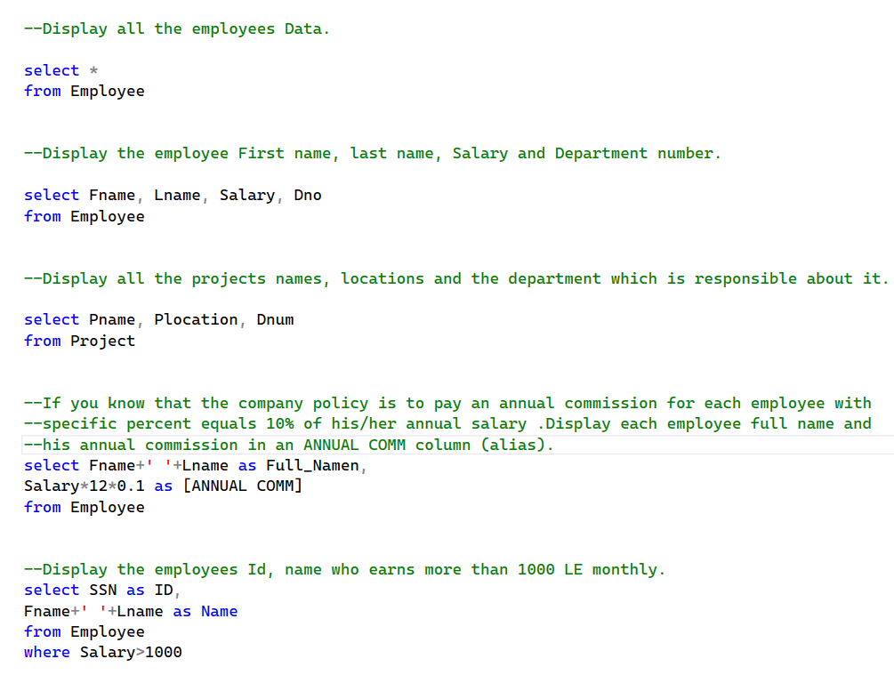
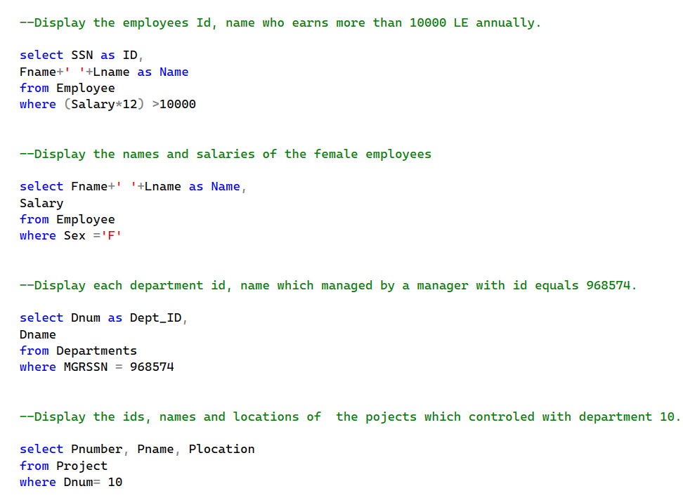

---

# 🔗 Lab02 - Joins

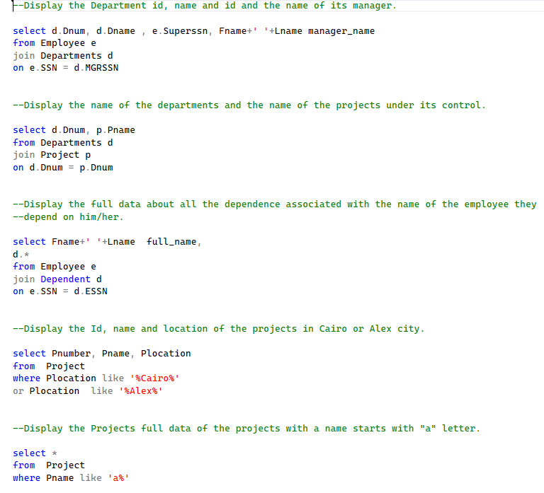
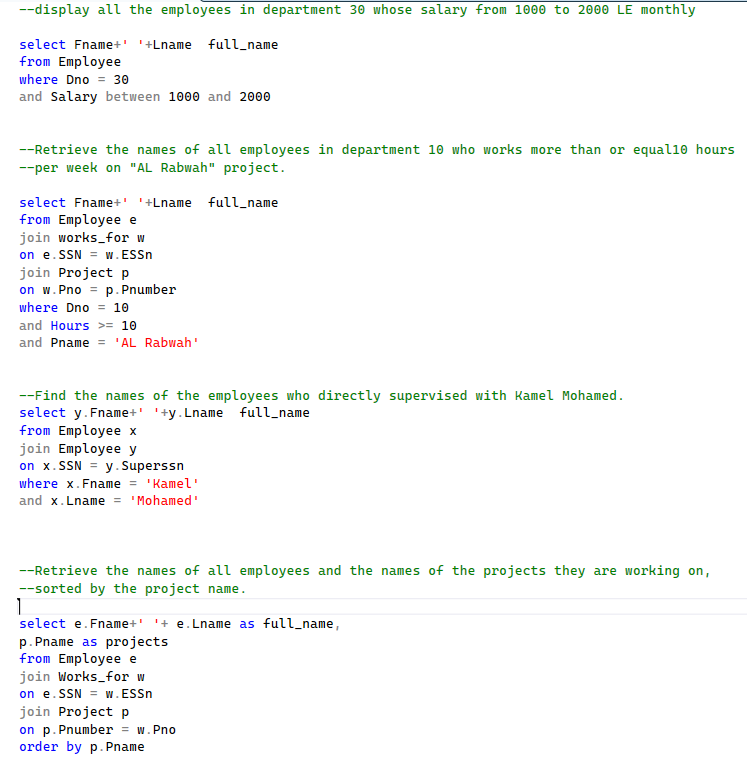
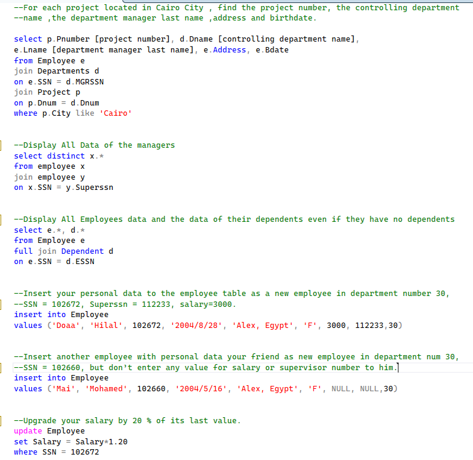

---

# 📊 Lab03 - Grouping & Aggregation

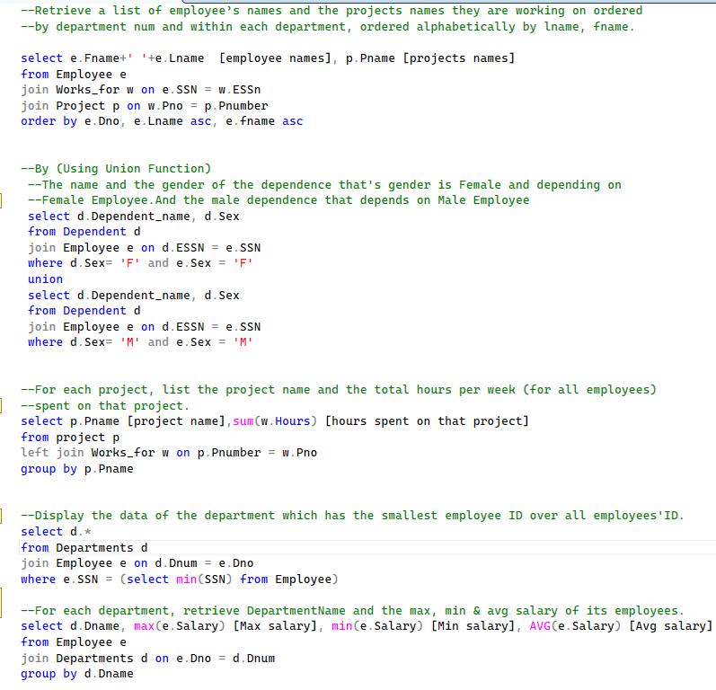
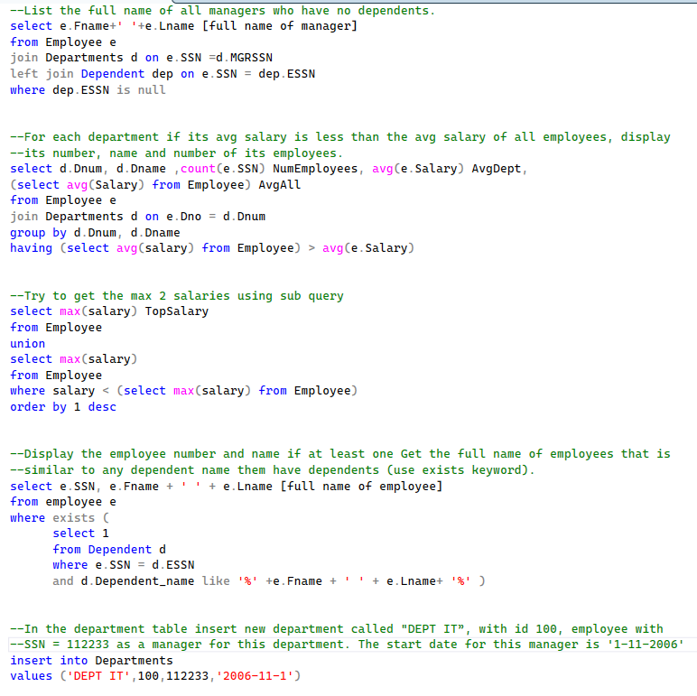
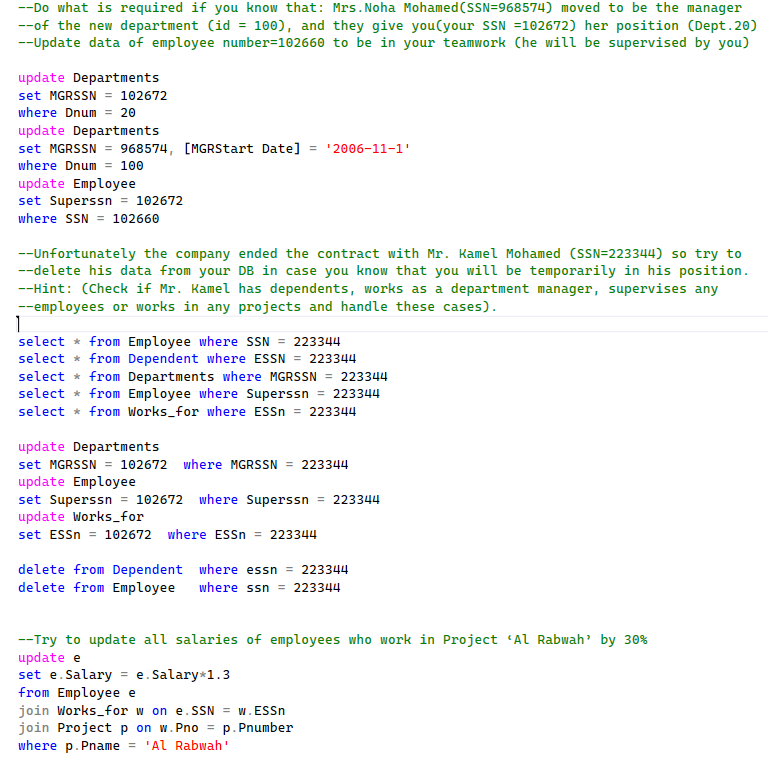

---

# ⚙ Lab04 - Advanced T-SQL

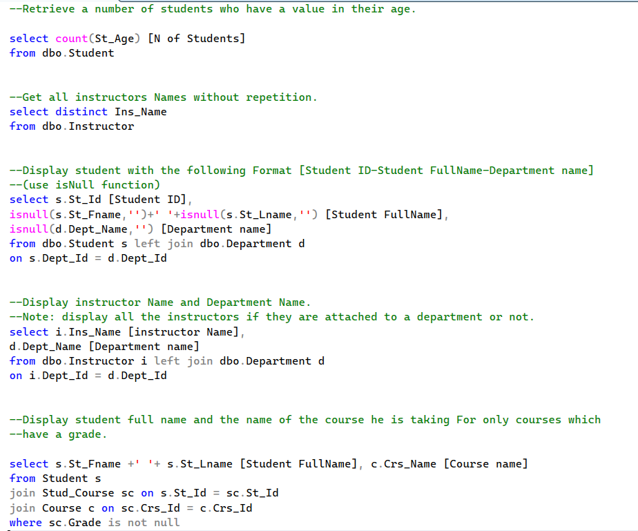
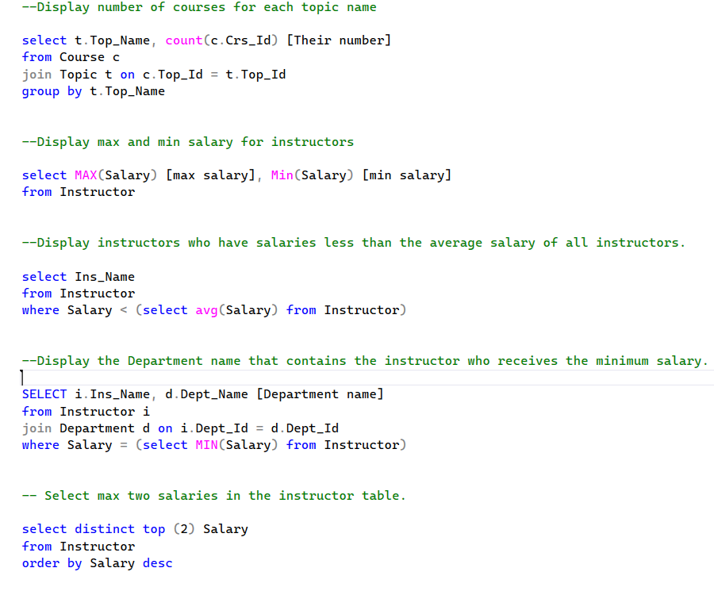
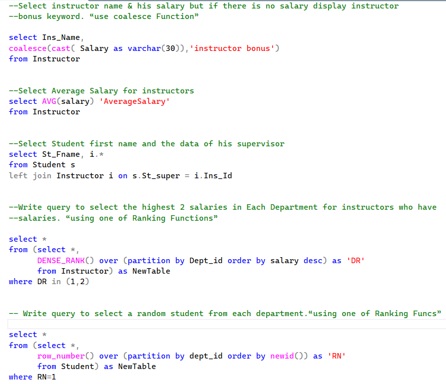

---

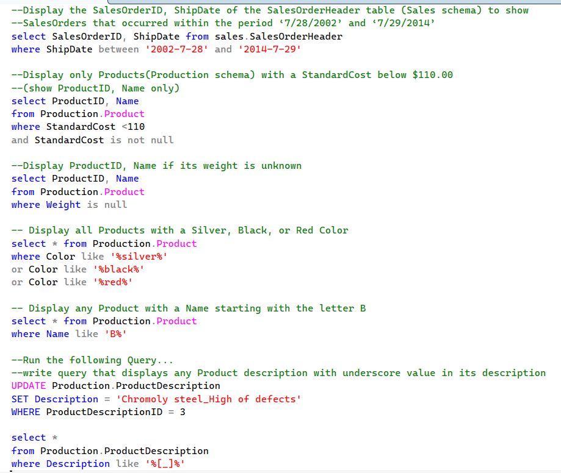
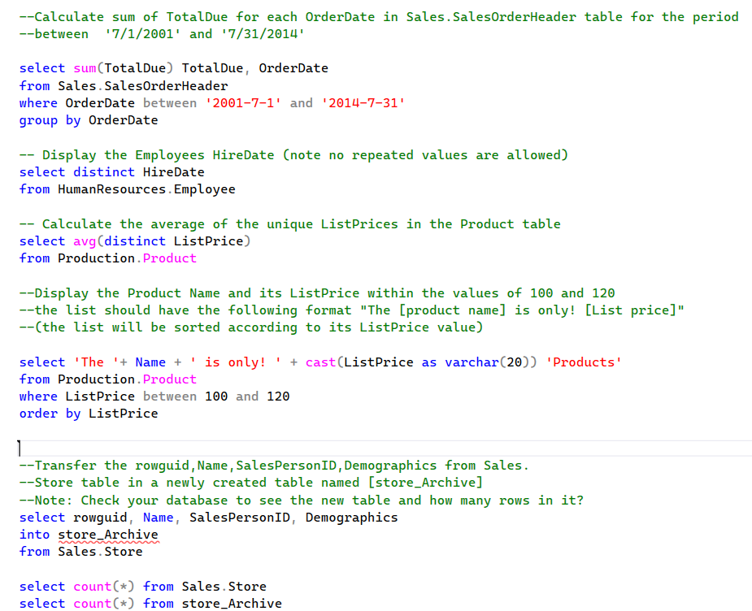
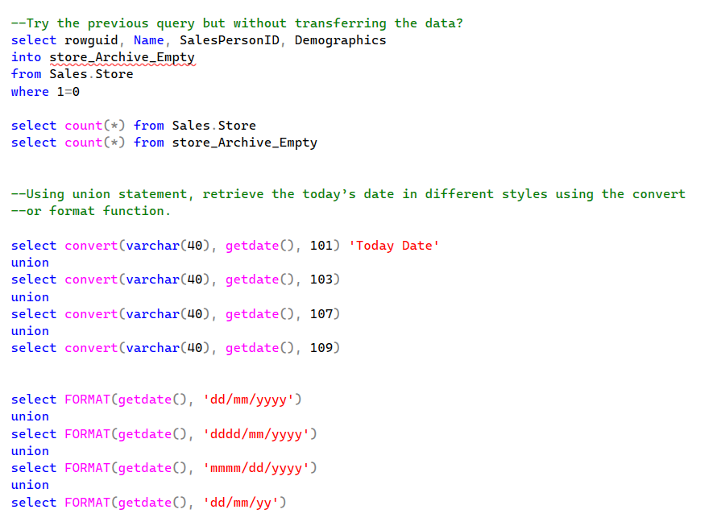

