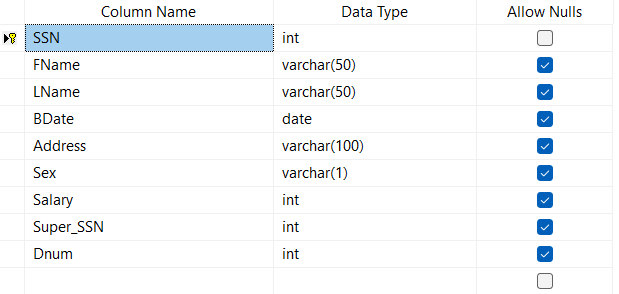
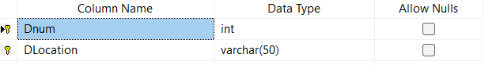
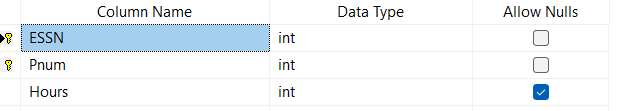
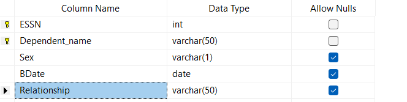

# Transact-SQL Queries using SQL Server

## 📌 Project Overview
This repository contains SQL labs and practice queries implemented using Microsoft SQL Server.  
The project covers fundamental and advanced Transact-SQL concepts through hands-on exercises on multiple databases.

---

## 🛠 Tools & Technologies
- Microsoft SQL Server
- SQL Server Management Studio (SSMS)
- Transact-SQL (T-SQL)

---

## 📂 Databases Used
- Company Database
- ITI Database
- AdventureWorks Database

---

## Lab01_DB Creation

### Create DB Diagram and insert rows per table 

### Restore Company DB then Try to create the Queries 

