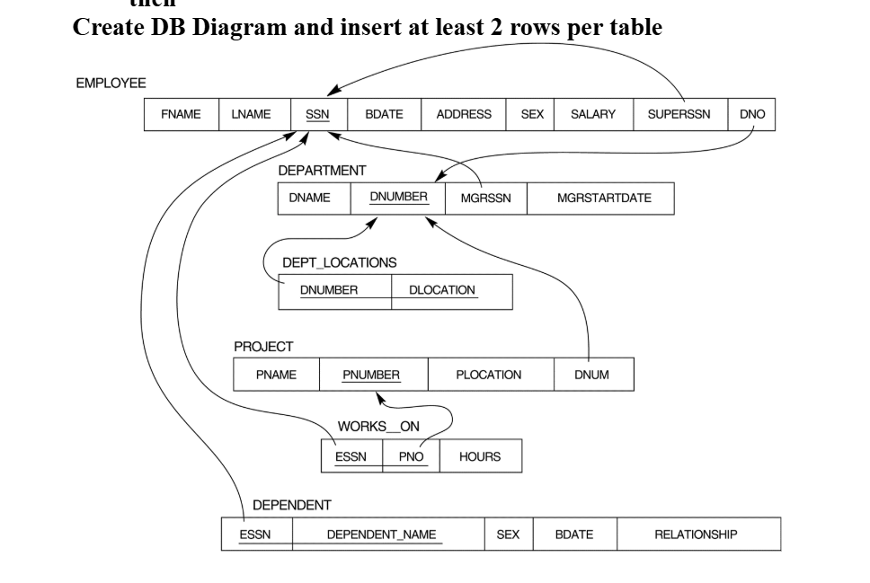
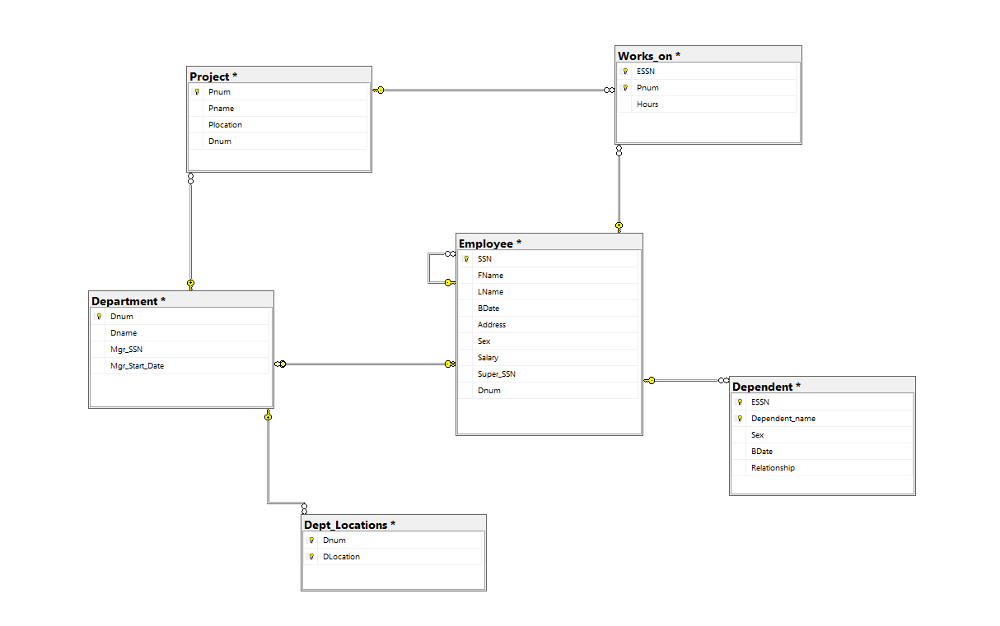
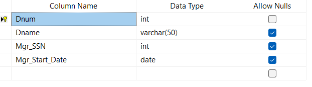
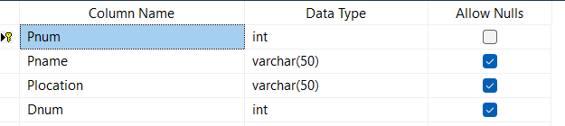
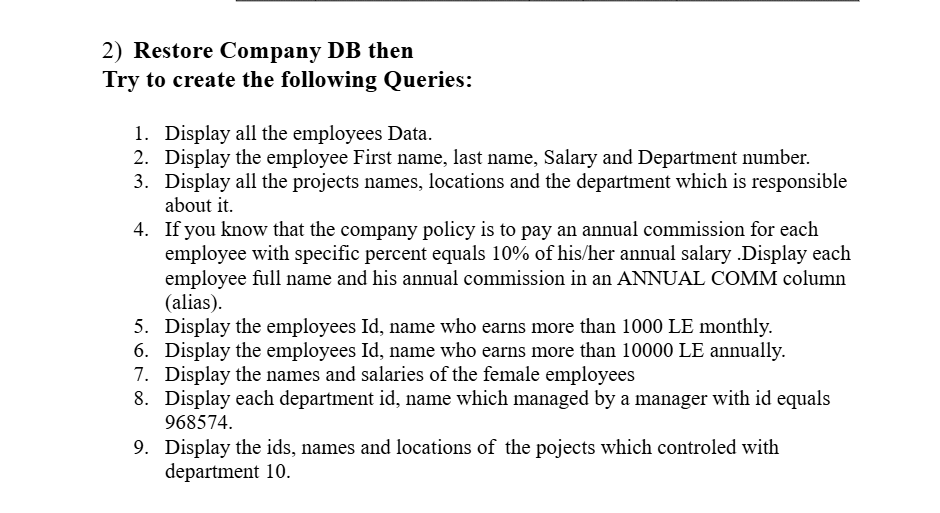
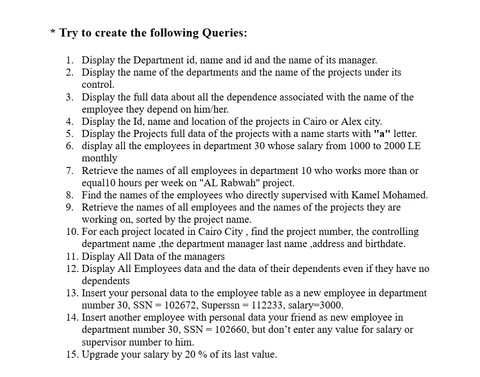
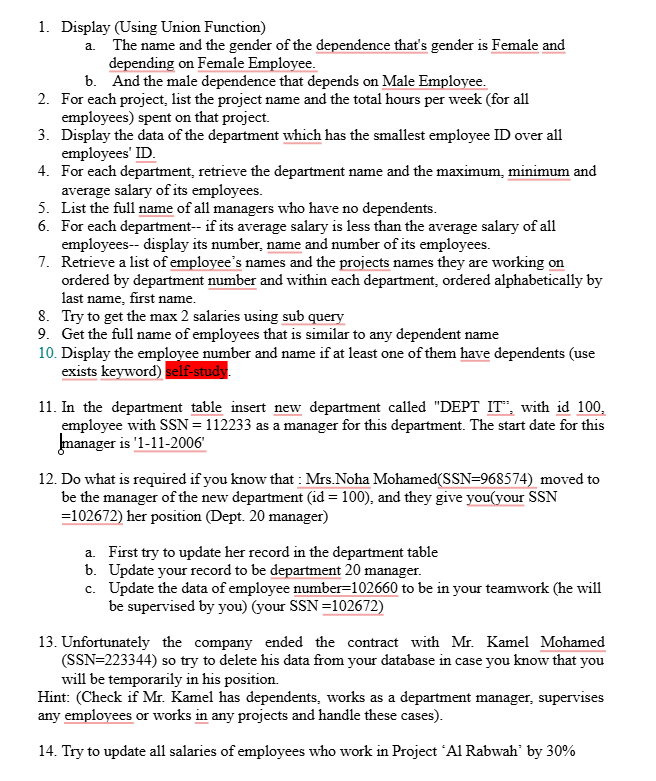
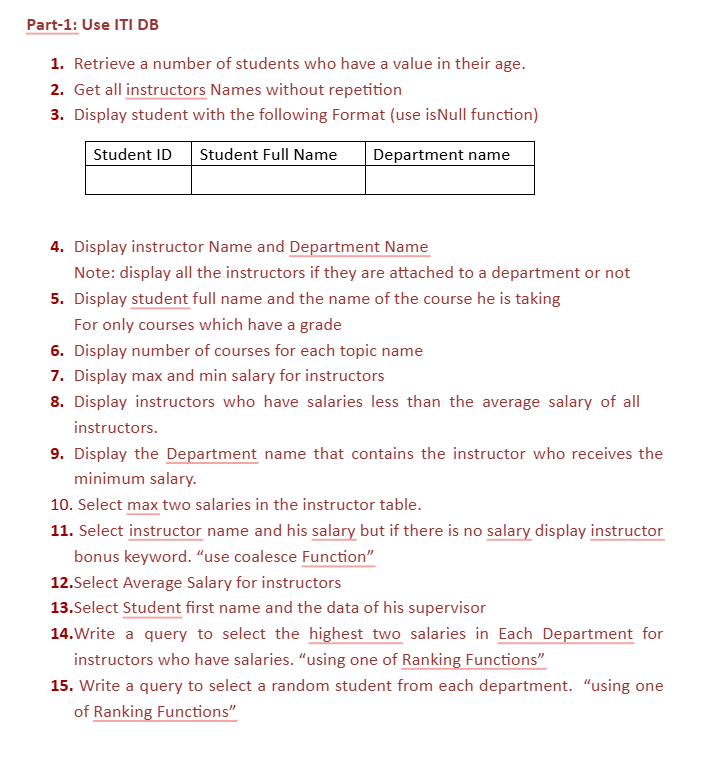
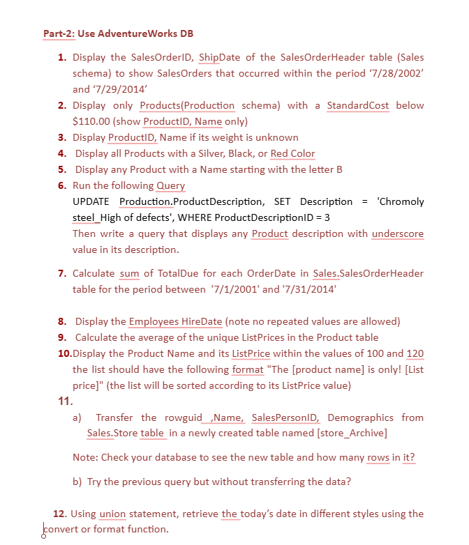

# Transact-SQL Queries using SQL Server

## 📌 Project Overview

This project contains practical SQL labs implemented using Microsoft SQL Server.

I worked on:
- Database creation and table relationships
- Writing complex SELECT queries
- Performing JOIN operations
- Using GROUP BY and aggregate functions
- Implementing advanced T-SQL queries

All queries were written and tested using SSMS.

---

## 🛠 Tools & Technologies
- Microsoft SQL Server
- SQL Server Management Studio (SSMS)
- Transact-SQL (T-SQL)

---

## 📂 Databases Used
- Company Database
- ITI Database
- AdventureWorks Database

---

# 🧩 Lab01 - Database Creation
                   

### Database Diagram

### Employee Table

### Department Table

### Locations Table

### Works On Table

### Dependent Table

### Project Table

# Lab01 Queries
                   

--Display all the employees Data.

select *
from Employee

--Display the employee First name, last name, Salary and Department number.

select Fname, Lname, Salary, Dno
from Employee

--Display all the projects names, locations and the department which is responsible about it.

select Pname, Plocation, Dnum
from Project

--If you know that the company policy is to pay an annual commission for each employee with
--specific percent equals 10% of his/her annual salary .Display each employee full name and
--his annual commission in an ANNUAL COMM column (alias).

select Fname+' '+Lname as Full_Namen, 
Salary*12*0.1 as [ANNUAL COMM]
from Employee

--Display the employees Id, name who earns more than 1000 LE monthly.

select SSN as ID, 
Fname+' '+Lname as Name 
from Employee
where Salary>1000 

--Display the employees Id, name who earns more than 10000 LE annually.

select SSN as ID, 
Fname+' '+Lname as Name 
from Employee
where (Salary*12) >10000

--Display the names and salaries of the female employees 

select Fname+' '+Lname as Name, 
Salary
from Employee
where Sex ='F'

--Display each department id, name which managed by a manager with id equals 968574.

select Dnum as Dept_ID,
Dname
from Departments
where MGRSSN = 968574

--Display the ids, names and locations of  the pojects which controled with department 10.

select Pnumber, Pname, Plocation
from Project
where Dnum= 10
---

# 🔗 Lab02 - Joins

---

# 📊 Lab03 - Grouping & Aggregation

---

# ⚙ Lab04 - Advanced T-SQL

